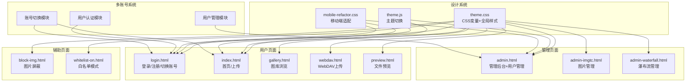
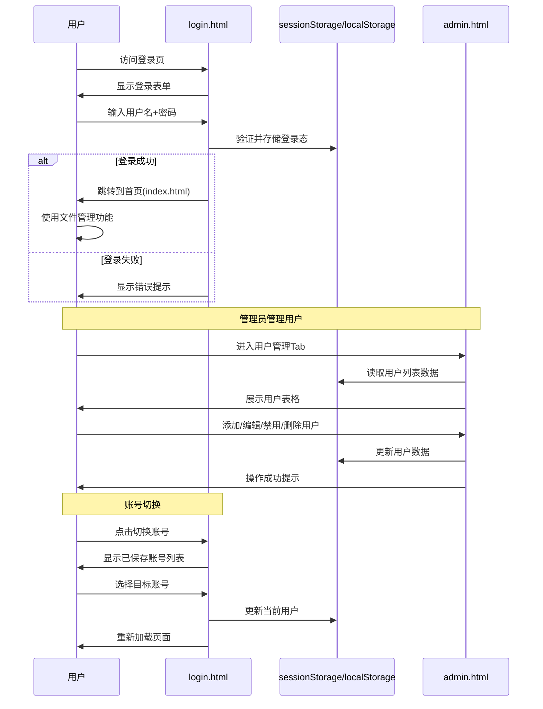

# 1940Netdisk 前端 UI 完整重构方案

## 一、重构目标

1. **设计风格统一**：全面采用「钢铁玻璃」军事工业风（参考文件设计）
2. **品牌重命名**：K-Vault → **1940Netdisk**（1940 网盘）
3. **完整的用户+身份组管理体系**：
   - 多用户注册/登录/切换
   - 身份组（角色组）管理
   - 版块（资源分区）管理
   - 基于身份组的权限控制
4. **全页面覆盖**：重构所有 11+ 个前端页面
5. **功能保留**：所有现有业务逻辑保持不变，仅更换 UI 皮肤
6. **README 中文化**：完整的中文项目文档

---

## 二、设计系统（Design System）

### 2.1 色彩体系

```css
/* 核心色调 */
--olive: #5A6B4A;        /* 橄榄绿 - 主色 */
--olive-dark: #3F4D34;   /* 深橄榄 */
--olive-light: #6B7E56;  /* 浅橄榄 */
--steel: #6B7A8A;        /* 钢灰 - 辅助色 */
--steel-dark: #4A5560;   /* 深钢灰 */
--khaki: #B8A88A;        /* 卡其 - 文字/装饰 */
--khaki-light: #D4C9AD;  /* 浅卡其 */
--rust: #8B5A2B;         /* 锈色 - 危险/强调 */
--rust-light: #A87040;   /* 浅锈色 */
--gold: #D4AF37;         /* 金色 - 高亮/强调 */
--gold-light: #E8CF9E;   /* 浅金色 */

/* 背景色系 */
--bg-dark: #1a1c1a;       /* 最深背景 */
--bg-surface: #222422;    /* 表面卡片 */
--bg-elevated: #2a2c2a;  /* 悬浮状态 */
--bg-hover: #303230;     /* 悬停背景 */

/* 文字色系 */
--text-primary: #E8E0D0;
--text-secondary: #B8A88A;
--text-muted: #7A7568;

/* 边框色系 */
--border-subtle: rgba(90, 107, 74, 0.4);
--border-gold: rgba(212, 175, 55, 0.3);
```

### 2.2 字体系统

```css
--font-title: 'Bebas Neue', 'Impact', 'Arial Black', sans-serif;
--font-body: 'Roboto', 'Segoe UI', system-ui, sans-serif;
--font-mono: 'JetBrains Mono', 'Courier New', monospace;
```

### 2.3 圆角与阴影

```css
--radius-sharp: 2px;    /* 锐利直角 */
--radius-card: 3px;     /* 卡片微圆角 */
--shadow-card: 0 4px 20px rgba(0, 0, 0, 0.4);
--shadow-lg: 0 12px 40px rgba(0, 0, 0, 0.6);
```

### 2.4 背景纹理

- 细微噪点纹理叠加（SVG filter: fractalNoise）
- 三处径向渐变光晕（橄榄绿/锈色/钢灰）
- 固定背景附着，营造深度感

---

## 三、多账号管理体系

### 3.1 完整数据模型

```javascript
// ============================================================
//  完整数据模型（localStorage 存储，key: netdisk1940_data）
// ============================================================

// 默认数据
{
  // ---- 用户系统 ----
  users: [
    {
      id: 'u1',
      username: 'admin',
      password: 'admin123',
      nickname: '管理员',
      role: 'admin',        // admin(管理员) | user(普通用户)
      avatar: '管',          // 头像文字（取昵称首字）
      status: 'active',     // active(正常) | disabled(已禁用)
      storage: { used: 0, total: 10737418240 }, // 已用/总空间
      groupIds: ['g1'],     // 所属身份组ID数组
      createdAt: Date.now() - 86400000 * 30,
      lastLoginAt: Date.now()
    },
    {
      id: 'u2',
      username: 'user1',
      password: '123456',
      nickname: '用户一',
      role: 'user',
      avatar: '用',
      status: 'active',
      storage: { used: 0, total: 10737418240 },
      groupIds: ['g2'],
      createdAt: Date.now() - 86400000 * 15,
      lastLoginAt: Date.now() - 3600000
    }
  ],

  // ---- 身份组系统 ----
  groups: [
    {
      id: 'g1',
      name: '管理组',
      description: '系统管理员组，拥有所有版块的全部权限',
      userIds: ['u1'],
      permissions: {
        's1': 'write',   // write=读写 | read=只读 | none=无权限
        's2': 'write'
      },
      createdAt: Date.now() - 86400000 * 30
    },
    {
      id: 'g2',
      name: '普通用户组',
      description: '普通用户，仅可访问公共资源',
      userIds: ['u2'],
      permissions: {
        's1': 'read',    // 公共资源只读
        's2': 'none'     // 项目文档无权限
      },
      createdAt: Date.now() - 86400000 * 15
    }
  ],

  // ---- 版块系统（资源分区） ----
  sections: [
    { id: 's1', name: '公共资源', description: '所有用户可访问的公共区域' },
    { id: 's2', name: '项目文档', description: '项目组内部文档' },
    { id: 's3', name: '设计资源', description: '设计稿和素材' }
  ],

  // ---- 文件系统 ----
  files: [
    { id: 'f1', name: '项目计划', type: 'folder', parentId: null, size: 0, uploadDate: Date.now() - 3600000, uploadedBy: 'u1', sectionId: 's1' },
    { id: 'f2', name: '会议纪要.docx', type: 'file', parentId: null, size: 24576, uploadDate: Date.now() - 7200000, uploadedBy: 'u1', sectionId: 's1' },
    { id: 'f3', name: 'logo.png', type: 'file', parentId: null, size: 102400, uploadDate: Date.now() - 1800000, uploadedBy: 'u2', sectionId: 's1' },
    { id: 'f4', name: '设计稿', type: 'folder', parentId: null, size: 0, uploadDate: Date.now() - 5400000, uploadedBy: 'u1', sectionId: 's2' }
  ],

  // ---- 运行时状态 ----
  currentUserId: 'u1',          // 当前登录用户ID
  nextId: { user: 3, group: 3, section: 4, file: 5 }  // ID自增计数器
}
```

### 3.2 三权分立体系

本系统实现了 **用户 ↔ 身份组 ↔ 版块** 的三层权限模型：

```
用户 (User)                     身份组 (Group)                  版块 (Section)
┌──────────┐                  ┌──────────────┐               ┌──────────────┐
│ admin    │── belongs to ──→ │ 管理组        │── has ──────→│ 公共资源      │
│ user1    │── belongs to ──→ │ 普通用户组    │   permissions │ 项目文档      │
│ user3    │── belongs to ──→ │ VIP组         │   = write    │ 设计资源      │
└──────────┘                  └──────────────┘    /read/none └──────────────┘
```

- **用户**可以属于多个身份组
- **身份组**包含多个用户，并对每个版块拥有独立权限（write/read/none）
- **版块**是资源分区，文件可归属于特定版块
- 用户的最终权限 = 其所属所有身份组中**最高权限**的合集

### 3.3 功能清单

| 模块 | 功能 | 说明 | 涉及页面 |
|------|------|------|----------|
| **登录注册** | 用户注册 | 新用户填写用户名/昵称/密码注册 | login.html |
| | 用户登录 | 用户名+密码登录验证 | login.html |
| | 用户登出 | 退出当前登录状态 | 所有页面 |
| | 账号切换 | 快速切换不同已登录账号 | 导航栏下拉菜单 |
| **用户管理** | 查看用户列表 | 表格展示所有用户信息 | admin.html |
| | 添加用户 | 管理员创建新用户 | admin.html |
| | 编辑用户 | 修改昵称/密码/角色 | admin.html |
| | 禁用/启用用户 | 控制用户登录权限 | admin.html |
| | 删除用户 | 删除用户及相关数据 | admin.html |
| | 用户分配身份组 | 为用户选择所属身份组 | admin.html |
| **身份组管理** | 查看身份组列表 | 卡片展示所有身份组 | admin.html |
| | 创建身份组 | 新建身份组 | admin.html |
| | 删除身份组 | 删除身份组 | admin.html |
| | 分配成员 | 从用户列表中勾选组员 | admin.html |
| | 设置版块权限 | 对每个版块设置write/read/none | admin.html |
| **版块管理** | 查看版块列表 | 展示所有版块 | admin.html |
| | 新建版块 | 创建新的资源分区 | admin.html |
| | 删除版块 | 删除版块 | admin.html |
| **个人信息** | 修改个人信息 | 修改昵称/密码等 | 设置弹窗 |

### 3.3 数据存储

**Cloudflare Pages 模式**：
- 通过 `img_url` KV 存储用户数据
- API 接口：`/api/manage/users` 系列

**Docker 模式**：
- 通过 SQLite 存储用户数据
- 后端 Node API 处理

**前端本地模拟（demo 模式）**：
- `localStorage` 存储，key: `netdisk1940_data`
- 用于开发和演示

---

## 四、页面重构清单

### 4.1 全局文件

| 文件 | 改动类型 | 说明 |
|------|----------|------|
| [`theme.css`](theme.css) | **重写** | 替换为钢铁玻璃 CSS 变量系统，支持 light/dark 双主题 |
| [`theme.js`](theme.js) | **重写** | 简化主题切换逻辑，适配新 CSS 变量 |
| [`mobile-refactor.css`](mobile-refactor.css) | **重写** | 移动端响应式适配（侧边栏折叠/导航压缩/卡片自适应） |

### 4.2 核心页面

| 文件 | 优先级 | 当前风格 | 目标风格 |
|------|--------|----------|----------|
| [`index.html`](index.html) | P0 | 紫粉渐变霓虹 | 钢铁玻璃 + 多账号导航 |
| [`login.html`](login.html) | P0 | 紫粉渐变霓虹 | 钢铁玻璃 + 注册/登录切换 |
| [`admin.html`](admin.html) | P0 | 紫粉渐变 + Element UI | 钢铁玻璃 + 用户管理 tab |
| [`gallery.html`](gallery.html) | P1 | 紫粉渐变霓虹 | 钢铁玻璃图库 |
| [`webdav.html`](webdav.html) | P1 | 紫粉渐变 | 钢铁玻璃 |
| [`preview.html`](preview.html) | P1 | 浅色/深色简约 | 钢铁玻璃 |

### 4.3 辅助页面

| 文件 | 优先级 | 说明 |
|------|--------|------|
| [`block-img.html`](block-img.html) | P2 | 替换为钢铁玻璃风格 |
| [`whitelist-on.html`](whitelist-on.html) | P2 | 替换为钢铁玻璃风格 |
| [`admin-imgtc.html`](admin-imgtc.html) | P2 | 已有独立 CSS，融入新设计系统 |
| [`admin-waterfall.html`](admin-waterfall.html) | P2 | 瀑布流管理，更新为新风格 |

### 4.4 关于 Demo 页面（参考文件中的管理页面）

参考文件中有以下新管理页面概念：
- `sections.html`（版块管理）
- `groups.html`（身份组管理）
- `users.html`（用户管理）

这些功能将**集成到 admin.html 中**，作为新的管理 Tab，而非单独的页面。

---

## 五、页面布局结构（通用）

### 5.1 导航栏（Navbar）

```
┌──────────────────────────────────────────────────────┐
│ [1940·网盘]  / 首页 / 全部文件  [搜索框] [上传] [头像] │
└──────────────────────────────────────────────────────┘
```

- 左侧：Logo（1940·网盘）+ 面包屑导航
- 右侧：搜索框 + 上传按钮 + 用户头像（点击弹出下拉）

### 5.2 侧边栏（Sidebar）

```
┌─────────┬────────────────────────────────────────────┐
│ 导航     │   内容区域                                  │
│ ─────── │                                            │
│ 🏠 首页  │                                            │
│ 📁 全部文件│                                            │
│ 👥 用户管理│                                            │
│ 🔒 身份组 │                                            │
│ 📋 版块管理│                                            │
│          │                                            │
│ 存储空间  │                                            │
│ [████░░] │                                            │
│ 6.2/10GB │                                            │
└─────────┴────────────────────────────────────────────┘
```

### 5.3 用户下拉菜单

```
┌─────────────────────┐
│ 当前用户: admin      │
│ 角色: 管理员         │
│ ─────────────────── │
│ 📋 上传记录          │
│ ⚙️ 个人设置          │
│ 🔄 切换账号          │
│ ─────────────────── │
│ 🚪 退出登录          │
└─────────────────────┘
```

---

## 六、多账号管理详细设计

### 6.1 login.html 新增功能

**登录面板**：
- 用户名输入框（带用户图标）
- 密码输入框（带密码显隐切换）
- "记住我" 复选框
- 登录按钮
- "没有账号？注册" 切换链接

**注册面板**：
- 用户名输入框
- 昵称输入框
- 密码输入框
- 确认密码输入框
- 注册按钮
- "已有账号？登录" 切换链接

**多账号快速切换**（登录后）：
- 在用户下拉菜单中显示 "切换账号"
- 点击后弹出已保存的账号列表
- 点击任意账号可快速切换

### 6.2 admin.html 新增管理功能

**用户管理 Tab**：
- 用户列表表格（用户名/昵称/角色/状态/空间用量/操作）
- 添加用户弹窗（设置用户名/密码/角色）
- 编辑用户（修改昵称/重置密码/更改角色）
- 禁用/启用用户
- 删除用户

### 6.3 账号切换逻辑

```javascript
// 前端模拟实现
const accounts = [
  { id: 'u1', username: 'admin', nickname: '管理员', role: 'admin' },
  { id: 'u2', username: 'user1', nickname: '用户一', role: 'user' },
];

// 当前账号存储在 sessionStorage
let currentUser = JSON.parse(sessionStorage.getItem('currentUser'));

// 切换账号
function switchAccount(userId) {
  const user = accounts.find(u => u.id === userId);
  sessionStorage.setItem('currentUser', JSON.stringify(user));
  location.reload();
}

// 登出
function logout() {
  sessionStorage.removeItem('currentUser');
  window.location.href = '/login.html';
}
```

---

## 七、实施步骤

### 阶段一：全局样式系统（文件少但影响大）

1. 重写 [`theme.css`](theme.css) — 定义所有 CSS 变量（钢铁玻璃色系）
2. 重写 [`theme.js`](theme.js) — 简化主题切换
3. 重写 [`mobile-refactor.css`](mobile-refactor.css) — 移动端适配

### 阶段二：核心页面重构（P0）

4. 重构 [`login.html`](login.html) — 新设计 + 注册/登录切换 + 多账号选择
5. 重构 [`index.html`](index.html) — 新设计 + 多账号导航
6. 重构 [`admin.html`](admin.html) — 新设计 + 用户管理 Tab + 身份组/版块管理

### 阶段三：次级页面重构（P1）

7. 重构 [`gallery.html`](gallery.html)
8. 重构 [`webdav.html`](webdav.html)
9. 重构 [`preview.html`](preview.html)

### 阶段四：辅助页面重构（P2）

10. 重构 [`block-img.html`](block-img.html)
11. 重构 [`whitelist-on.html`](whitelist-on.html)
12. 重构 [`admin-imgtc.html`](admin-imgtc.html)
13. 重构 [`admin-waterfall.html`](admin-waterfall.html)

### 阶段五：文档

14. 重写 [`README.md`](README.md) — 中文文档，项目名 1940Netdisk

---

## 八、架构图



## 九、多账号数据流



---

## 十、关键注意事项

1. **向后兼容**：所有 API 接口路径不变，后端逻辑不动
2. **Element UI 移除**：新设计不再依赖 Element UI，改为纯原生 CSS
3. **Font Awesome 保留**：图标库保持使用
4. **Theme 兼容**：`theme.css` 和 `theme.js` 的接口保持与旧版一致（`data-theme` 属性）
5. **localStorage 数据兼容**：旧版用户数据中的 `themeMode` 键保持读取
6. **SEO/社交标签**：更新所有页面的 title 和 meta 标签为 "1940Netdisk"
